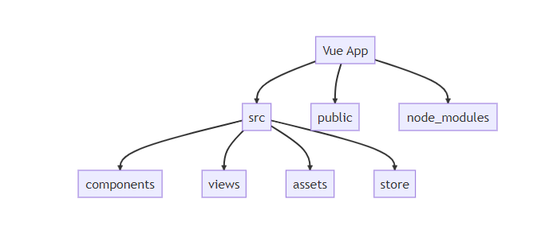

# FrontEnd - Project - VueJS and TailwindCSS

In this portfolio project, I am showcasing a minimalist todo list application designed for both mobile and web views. The project leverages the power of Vue.js for dynamic front-end functionality and utilizes the sleek and responsive Tailwind CSS framework for an enhanced user interface.

## Objectives 

The primary aim of this project is to create a **user-friendly home page** featuring a **list of tasks** scheduled for the current date. Additionally, the application will provide a preview of upcoming projects with their respective end dates. Notably, all data storage and manipulation will be performed exclusively on the client-side, eliminating the need for a backend.

## Technology Used

- **VueJs** : Vue.js is the core framework driving the dynamic behavior of the application. It enables efficient data binding, component-based architecture, and interactive user interfaces.
- **Tailwind CSS** : Tailwind CSS is responsible for the elegant and responsive design of the application. It streamlines the styling process, ensuring a consistent and visually pleasing user experience.

## Folder Structure - VueJS

## Key Features

- **Mobile Responsiveness**: The todo list is thoughtfully designed to be fully functional and visually appealing on mobile devices, offering users the flexibility to manage their tasks on the go.

- **Task Management**: Users can easily add, edit, and remove tasks, making it a convenient tool for tracking daily responsibilities.

- **Upcoming Projects**: The application provides a snapshot of forthcoming projects, ensuring users stay organized and prepared.

- **Client-Side Data Storage**: All data, including tasks and project details, is stored locally on the client-side, eliminating the need for server-side database interactions.

## Futur Enhancements

- **User Authentication**: Incorporating user accounts and authentication for personalized task management.

- **Data Synchronization**: Implementing synchronization with a backend server to enable data sharing and access across multiple devices.

- **Task Prioritization**: Adding features to prioritize tasks based on urgency or importance

# Conclusion 

This portfolio project demonstrates my proficiency in developing responsive web applications using Vue.js and Tailwind CSS. It showcases my commitment to best practices in project organization and highlights my potential for creating even more feature-rich and user-friendly applications in the future.